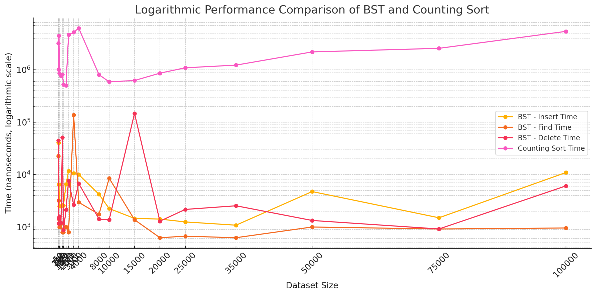
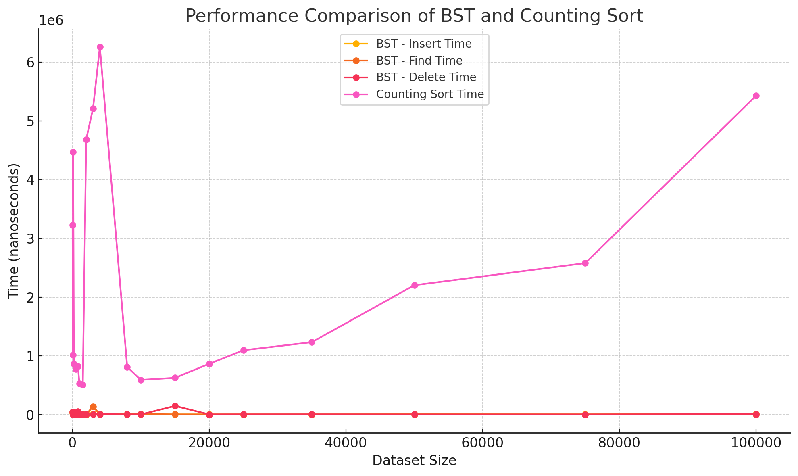

# hsa-data-structures-and-algorithms

# Task 
- Implement class for Balanced Binary Search Tree that can insert, find and delete elements.
- Generate 100 random datasets and measure complexity.
- Implement Counting Sort algorithm.
- Figure out when Counting Sort doesn't perform.

## How to start
1. Clone the repo to local machine
2. Head to `./server` on local machine and run `npm install` (required once to create node_modules folder before it will be projected to inner docker container filesystem)
3. Head to root of the cloned repo
4. Run `docker-compose up -d`
5. Wait for service messages in container console to finish project building

## Results

| Dataset Size | BST - Insert Time (ns) | BST - Find Time (ns) | BST - Delete Time (ns) | Counting Sort Time (ns) |
|--------------|------------------------|----------------------|------------------------|-------------------------|
| 10           | 41125                  | 22583                | 44667                  | 3228834                 |
| 50           | 40584                  | 3208                 | 1167                   | 1013250                 |
| 100          | 6500                   | 1417                 | 1458                   | 4469459                 |
| 200          | 2500                   | 1000                 | 1583                   | 863500                  |
| 500          | 2500                   | 1167                 | 1208                   | 775667                  |
| 800          | 2625                   | 792                  | 51416                  | 819750                  |
| 1000         | 2584                   | 792                  | 875                    | 527292                  |
| 1500         | 6541                   | 1000                 | 2125                   | 505375                  |
| 2000         | 11750                  | 792                  | 7625                   | 4686125                 |
| 3000         | 10583                  | 137583               | 2666                   | 5210916                 |
| 4000         | 10041                  | 2959                 | 6792                   | 6261708                 |
| 8000         | 4208                   | 1750                 | 1417                   | 809667                  |
| 10000        | 2250                   | 8542                 | 1375                   | 591000                  |
| 15000        | 1459                   | 1375                 | 147125                 | 626500                  |
| 20000        | 1417                   | 625                  | 1292                   | 864792                  |
| 25000        | 1250                   | 667                  | 2166                   | 1095709                 |
| 35000        | 1083                   | 625                  | 2542                   | 1232500                 |
| 50000        | 4750                   | 1000                 | 1333                   | 2202667                 |
| 75000        | 1500                   | 916                  | 917                    | 2578791                 |
| 100000       | 10959                  | 958                  | 6083                   | 5431042                 |

### Conclusions:
1. BST insert operation is quite fast, doesn't raise drastically with dataset volume increase
2. BST delete operation has some noise in first quarter of datasets, then it goes merely the same as insert
3. BST find similar to delete, but has less noise in first quarter of datasets
4. Count sort has some spike on datasets of size <10K; almost close to exponential growth with dataset volume increase 